# Puzzles

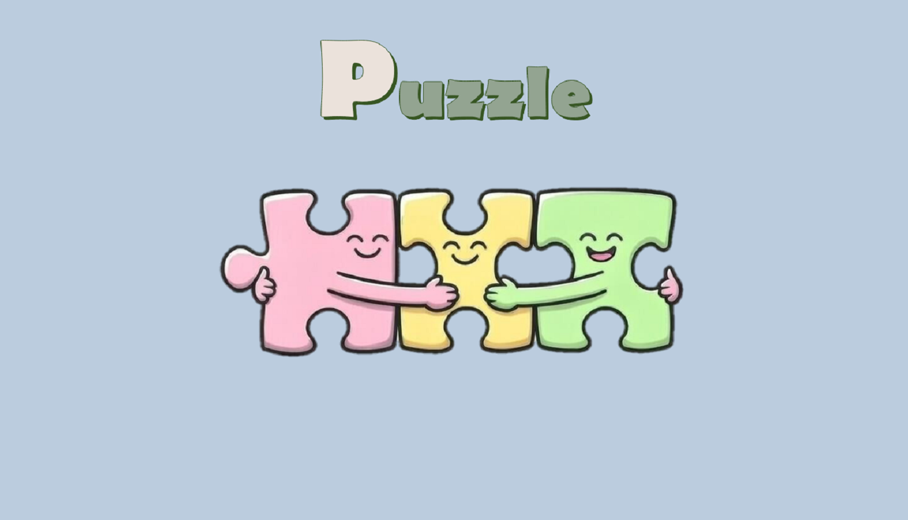

---

**Игра-головоломка** Пазлы считаются не просто игрой или неким развлечением, позволяющим заполнить свободное время. В небольших фрагментах целой картины скрывается большая польза для людей всех возратов. Сборка пазлов тренирует память, развивает концетрацию внимания и способствует формированию образного мышления, заставляет человека думать стратегически.  
**Вашему вниманию представлена _электронная версия знакомой всем игры_.** 

---

_Игра рассчитанна на ПК и имеет поддержку книжной и альбомной ориентации у смартфонов._

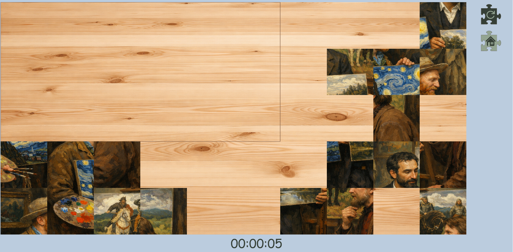
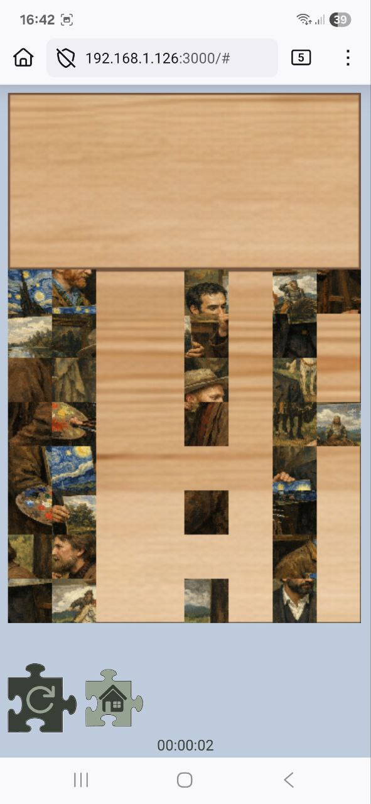
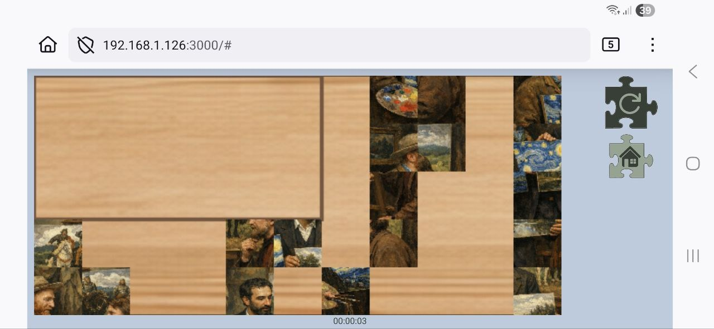

## Stage №1

```
После загрузки всех вложений и открытия файла "index.html", Вас встречает главная страница со стройкой меню, в котором следует выбрать категорию - тему картины для сборки.
```

**Категории меню:**
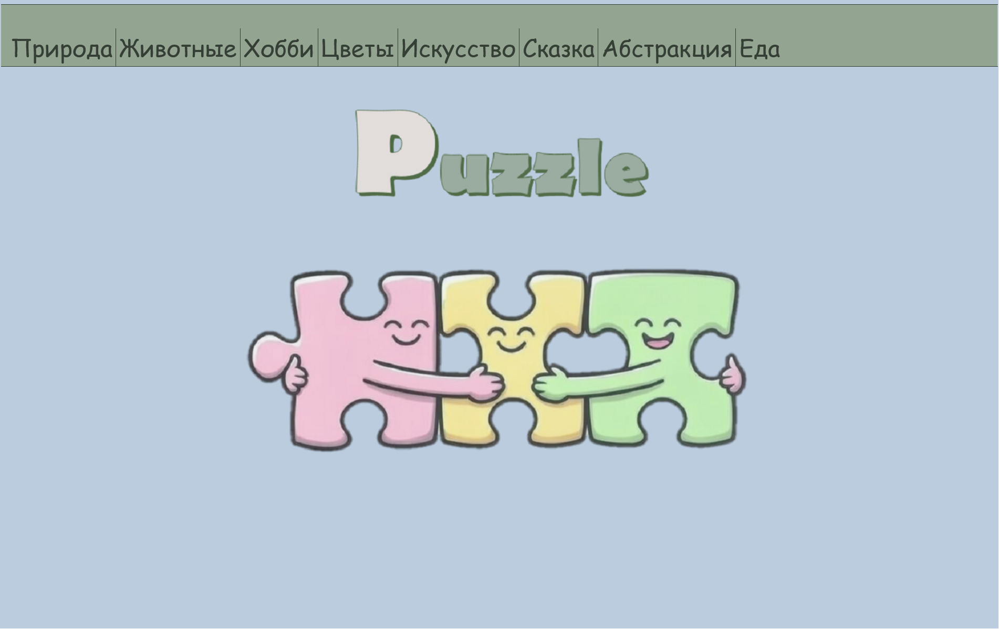
-  `природа` свежий весенний пейзаж с березами и первыми подснежниками;
-  `животные` два пушистых котёнка окраса табби;
-  `хобби` стопки книг и комнатные растения на полке;
-  `цветы` нежно-розовый розовый букет;
-  `искусство` великие художники с их знаменитыми произведениями;
-  `сказка` известные персонажи славянского фольклора;
-  `абстракция` неконтролируемое буйство ярких красок;
-  `еда` блюдо, снискавшее популярность во все мире.

## Stage №2

```
Далее следует определиться с уровнем сложности игры. На выбор представлены 4 варианта количества фрагментов, на любой вкус.
```

**Количество элементов:**
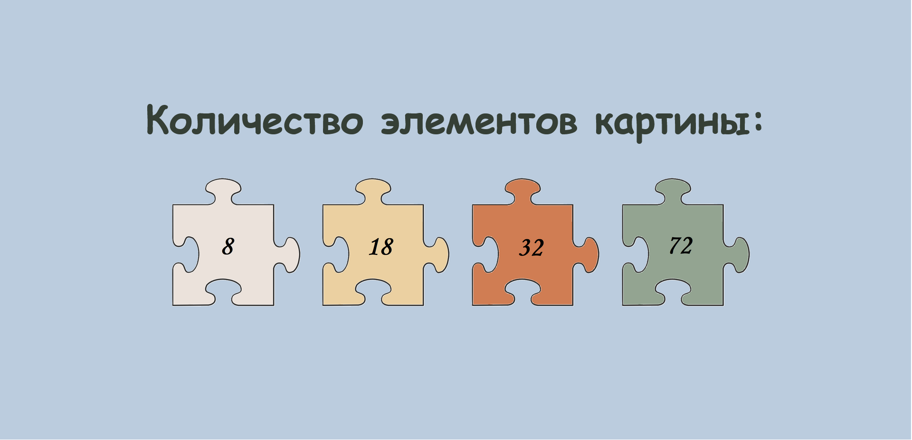
-  `8 элементов` - самый лёгкий уровень, элементы крупные, каждый фрагмент содержит явные детали общей картины;
-  `18 элементов` - детали поменьше, но на каждой ещё просматривается свой мини-сюжет;
-  `32 элемента` - интересный уровень, однако, следует постараться, чтобы отыскать расположение фрагментов на поле сборки;
-  `72 элемента` - уровень со множеством мелких деталей, для настоящих поклонников игры. (Можно дополнительно усложнить задачу, выбрав в качестве сборки картину из категории "абстракция").

## Stage №3

```
После того, как Вы решили "что" и "как" будете собирать, начинается непосредственно сама игра. Запускается таймер. Перед Вами открывается поле с перемешанными фрагментами, очерченный верхний левый угол - поле сборки картины.
```
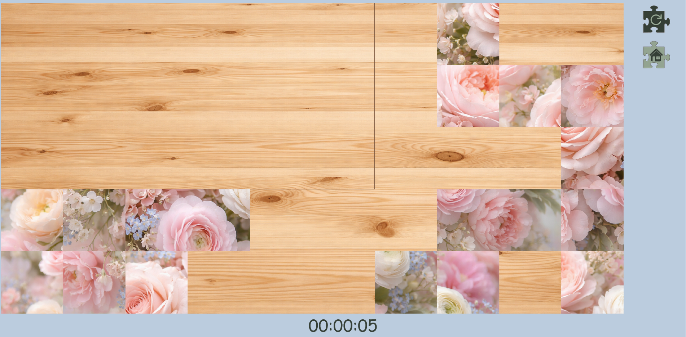

**Порядок игры:** 
1. Для того, чтобы выбрать фрагмент для переноса, следует кликнуть по избранному фрагменту. Элемент считается выбранным, когда он обрамлён в зеленую рамку. 
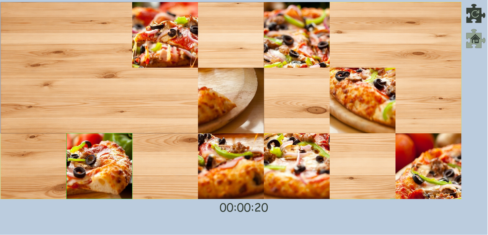

2. При помощи мыши перемещайте фрагмент по своему усмотрению, рамка элемента окрасится в жёлтый цвет. Кликом по фрагменту - Вы фиксируете его новое местоположение. Если фрагмент занял своё место раздастся звуковой сигнал - "щелчок", уведомляя об этом. После чего элемент станет недвижимым. На экране смартфона перемещать фрагменты можно - кликая по ним пальцем.


3. Играйте, пробуйте, подстраивайте фрагменты, пока не будет собрана вся картина.
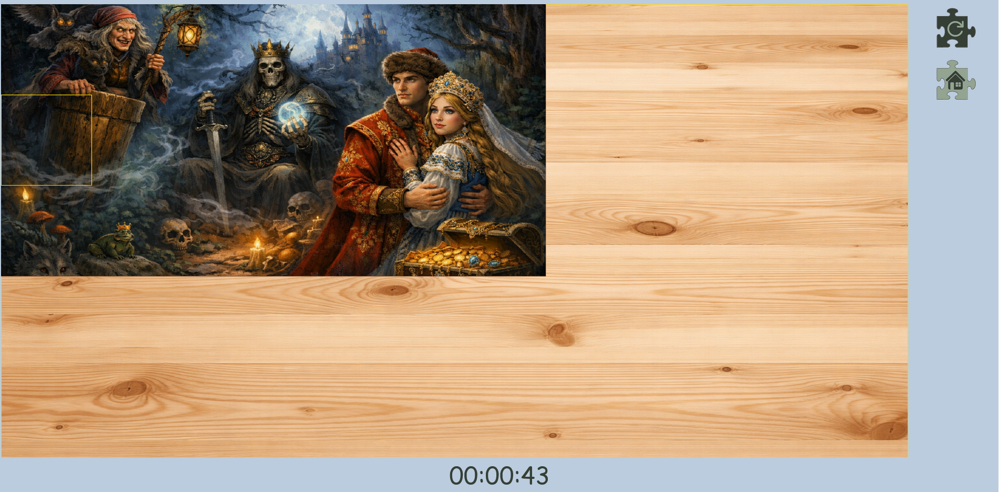

4. Как только картина будет полность собрана, игра завершится. Перед Вами появится результат, а также кнопка "home", при нажатии на которую, Вы возвращаетесть на домашнюю страницу, где можно вновь попробовать свои силы в новой игре.
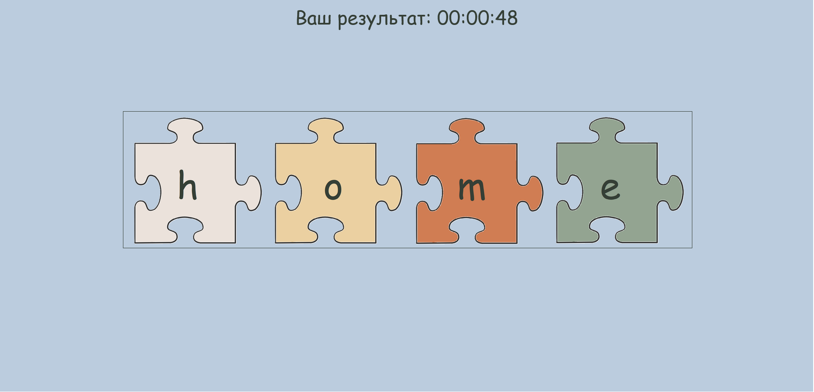

## Additional buttons
```
Дополнительные кнопки размещены рядом с игровым полем. Воспользоваться данными кнопками можно в любое время сборки картины.
```
**Update:** кнопка позволяет обновить игру (фрагменты перемешиваются, таймер обнуляется).
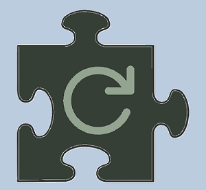

**Main screen:** кнопка позволяет завершить игру и вернуться на главный экран (домашнюю страницу).
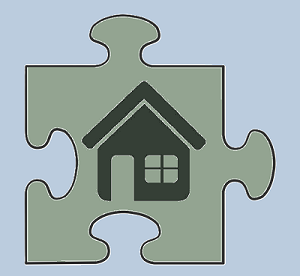

_Желаю **увлекательной** игры и **приятных** результатов!_
